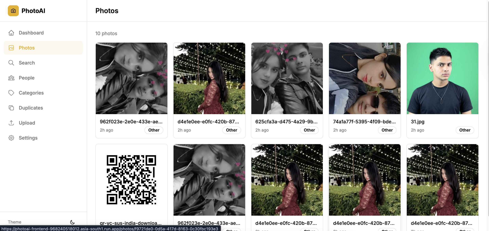
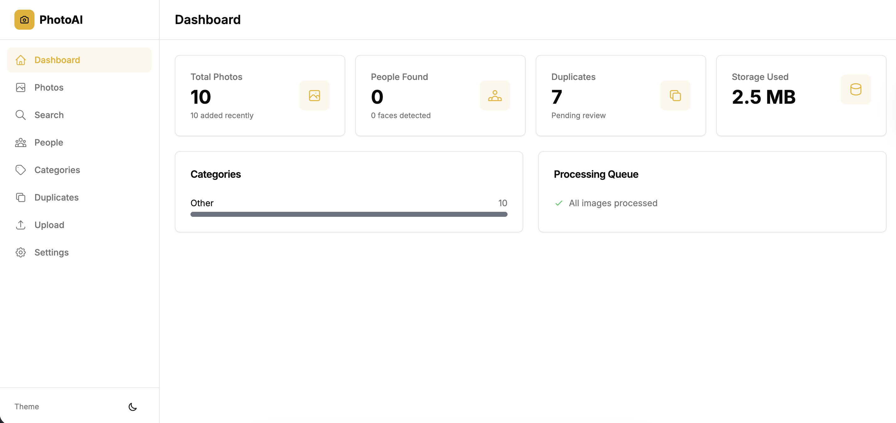
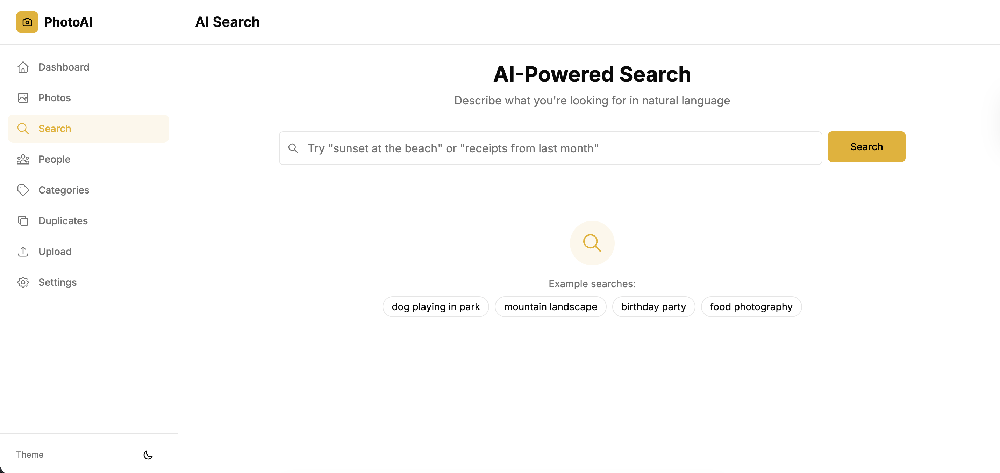

# PhotoAI — Intelligent Photo Management Platform

An AI-powered photo management platform that provides automatic categorization, face recognition, duplicate detection, and natural language search for large image libraries (100k+ images).

## Images

### Photos Page


### Dashboard (White Theme)


### AI Search Page


## Features

- **AI Categorization** — Automatically classifies photos (documents, prescriptions, receipts, people, travel, pets, food, nature) using Gemini Vision
- **Face Recognition** — Detects and groups faces across your library using InsightFace with incremental clustering
- **Duplicate Detection** — Three-tier detection: exact (MD5), near-duplicate (perceptual hash), and semantic (embedding similarity)
- **Natural Language Search** — Search photos by describing them in plain English using Vertex AI multimodal embeddings
- **Google Photos Integration** — OAuth2 sync with your Google Photos library
- **Scale** — Designed for 100k+ images with pgvector HNSW indexes, cursor pagination, and async processing
- **Dual Deployment** — Runs locally via Docker Compose or deploys to GCP with Terraform

## Architecture

### Local Deployment

```
┌──────────────────────────────────────────────────────────────┐
│                      Docker Network                          │
│                                                              │
│  ┌──────────┐   ┌──────────┐   ┌───────────────────────┐     │
│  │ Next.js  │──►│ FastAPI  │──►│  PostgreSQL 16        │     │
│  │ :3000    │   │ :8000    │   │  + pgvector extension │     │
│  └──────────┘   └────┬─────┘   └───────────────────────┘     │
│                      │                                       │
│          ┌───────────┼───────────┐                           │
│          ▼           ▼           ▼                           │
│  ┌──────────┐  ┌──────────┐  ┌──────────┐                    │
│  │  Celery  │  │  Redis   │  │  MinIO   │                    │
│  │ Workers  │  │  :6379   │  │  :9000   │                    │
│  └──────────┘  └──────────┘  └──────────┘                    │
│                                                              │
└──────────────────────────────────────────────────────────────┘
         │                              │
         ▼                              ▼
  ┌──────────────┐              ┌──────────────┐
  │ Vertex AI    │              │ Gemini       │
  │ Embeddings   │              │ Vision API   │
  └──────────────┘              └──────────────┘
```

### Cloud Deployment (GCP)

```
┌─────────────────────────────────────────────────────────┐
│                    Google Cloud Platform                │
│                                                         │
│  ┌──────────────┐  ┌──────────────┐  ┌─────────────┐    │
│  │  Cloud Run   │  │  Cloud Run   │  │  Cloud SQL  │    │
│  │  (Frontend)  │  │  (API)       │  │  PostgreSQL │    │
│  └──────────────┘  └──────┬───────┘  └─────────────┘    │
│                           │                             │
│            ┌──────────────┼──────────────┐              │
│            ▼              ▼              ▼              │
│    ┌────────────┐  ┌────────────┐  ┌──────────┐         │
│    │ Cloud Run  │  │ Memorystore│  │   GCS    │         │
│    │ (Worker)   │  │  (Redis)   │  │ Buckets  │         │
│    └────────────┘  └────────────┘  └──────────┘         │
│                                                         │
│  ┌──────────────┐  ┌──────────────┐  ┌─────────────┐    │
│  │  Vertex AI   │  │   Gemini     │  │  Artifact   │    │
│  │  Embeddings  │  │   Vision     │  │  Registry   │    │
│  └──────────────┘  └──────────────┘  └─────────────┘    │
│                                                         │
└─────────────────────────────────────────────────────────┘
```

## Tech Stack

| Layer | Local | Cloud (GCP) |
|-------|-------|-------------|
| Backend | FastAPI (Python 3.11) | Cloud Run |
| Frontend | Next.js 14 + shadcn/ui | Cloud Run |
| Database | PostgreSQL 16 + pgvector | Cloud SQL |
| Queue | Celery + Redis | Cloud Run + Memorystore |
| Storage | MinIO | Google Cloud Storage |
| AI Embeddings | Vertex AI Multimodal (1408d) | Same |
| AI Vision | Gemini 1.5 Flash | Same |
| Faces | InsightFace buffalo_l (512d) | Same |

## Project Structure

```
├── backend/             # FastAPI application
│   ├── app/
│   │   ├── api/         # REST endpoints
│   │   ├── models/      # SQLAlchemy ORM models
│   │   ├── ml/          # AI/ML modules (embeddings, faces, hashing)
│   │   ├── workers/     # Celery tasks
│   │   └── core/        # Database, storage, config
│   └── tests/
├── frontend/            # Next.js application
│   └── src/
│       ├── app/         # Pages (App Router)
│       ├── components/  # UI components
│       └── lib/         # API client, utilities
├── terraform/           # GCP infrastructure as code
├── deploy/              # CI/CD and deployment scripts
├── docs/                # Architecture and setup guides
└── postman/             # API collection
```

### Processing Pipeline

Each uploaded image goes through:
1. **Preprocess** — Thumbnail generation, EXIF extraction, MD5 hash
2. **Parallel Analysis** — Vertex AI embedding | Perceptual hashes | Face detection
3. **Intelligence** — Gemini categorization | Duplicate matching | Face clustering
4. **Complete** — WebSocket notification, stats update

## Quick Start (Docker)

### Prerequisites

- Docker & Docker Compose v2+
- (Optional) GCP project with Vertex AI & Gemini API access

### Setup

```bash
# Clone the repository
git clone <repo-url> && cd photoai

# Copy environment file
cp .env.example .env

# Start all services
docker compose up -d

# Run database migrations
docker compose exec api alembic upgrade head

# Open the app
open http://localhost:3000
```

### Available Commands

```bash
make dev          # Start all services
make down         # Stop all services
make migrate      # Run database migrations
make test         # Run all tests
make lint         # Lint backend code
make logs         # Tail service logs
```

## GCP Deployment

### One-Command Deploy

```bash
# 1. Set up terraform vars
cp terraform/terraform.tfvars.example terraform/terraform.tfvars
# Edit with your project details

# 2. Deploy everything
./deploy/deploy.sh <your-project-id> us-central1
```

### Manual Setup

See [docs/gcp-setup.md](docs/gcp-setup.md) for detailed step-by-step instructions.

### Infrastructure (Terraform)

```bash
cd terraform
terraform init
terraform plan
terraform apply
```

Provisions: Cloud SQL (pgvector), Memorystore (Redis), GCS buckets, Artifact Registry, Cloud Run services, VPC networking, IAM.

## API Documentation

- **Interactive Docs**: http://localhost:8000/docs (Swagger UI)
- **Postman Collection**: [postman/PhotoAI.postman_collection.json](postman/PhotoAI.postman_collection.json)

### Key Endpoints

| Method | Endpoint | Description |
|--------|----------|-------------|
| POST | `/api/v1/images/upload` | Upload images |
| GET | `/api/v1/images` | List images (cursor pagination) |
| POST | `/api/v1/search` | Natural language search |
| GET | `/api/v1/faces/clusters` | List people |
| GET | `/api/v1/duplicates` | List duplicate pairs |
| GET | `/api/v1/categories` | Categories with counts |
| GET | `/api/v1/stats/overview` | Dashboard stats |

## Testing

```bash
# Run all tests
make test

# Backend unit tests
docker compose exec api pytest tests/unit -v

# Backend integration tests
docker compose exec api pytest tests/integration -v

# Frontend tests
cd frontend && npm test
```

## Design Decisions

See [docs/design-decisions.md](docs/design-decisions.md) for rationale behind key technical choices.

## License

MIT
